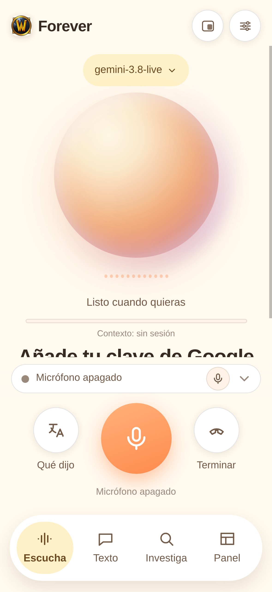
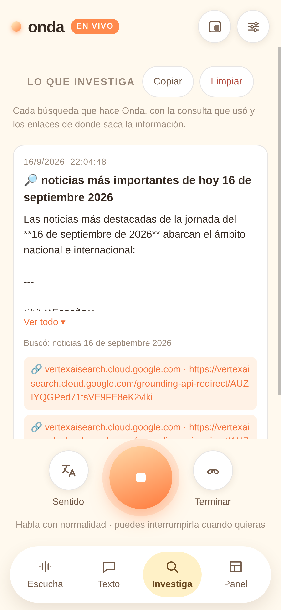
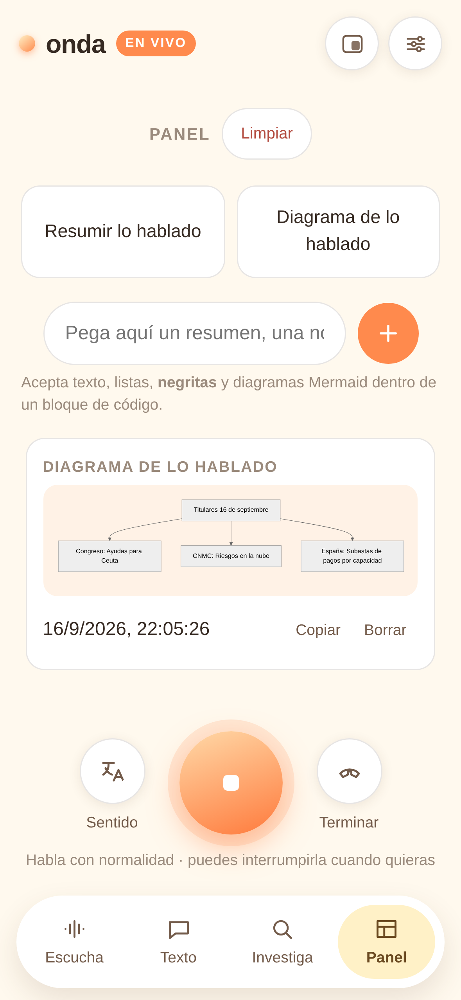
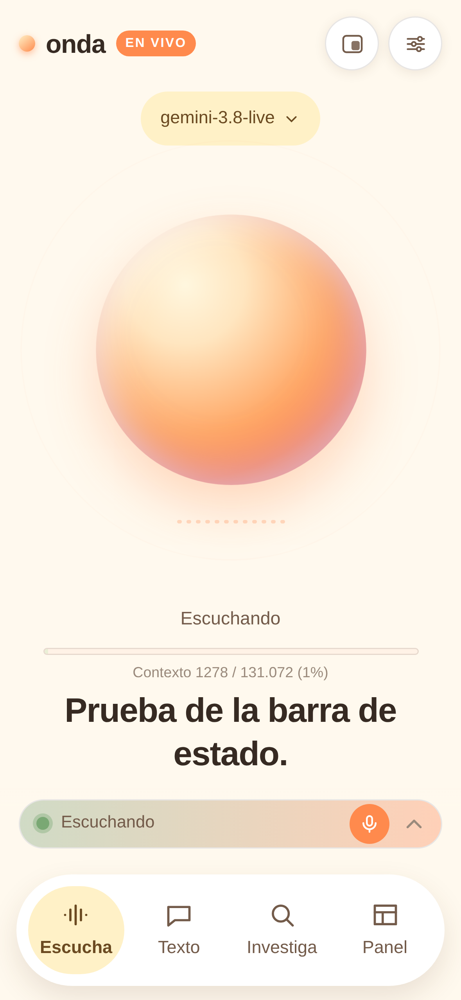

# Forever

**Agente de voz especializado en World of Warcraft, con latencia mínima, sobre los modelos `gemini-3.8-live`.**

Le preguntas hablando (o escribiendo) y te contesta en dos segundos: loot y porcentajes,
BiS y builds, talentos y prioridad de stats, macros, addons y WeakAuras, misiones, mapas y
coordenadas, jefes y mecánicas, notas de parche. Cuando el dato puede haber cambiado,
**busca en las webs que usa la comunidad** (Wowhead, Icy Veins, Murlok.io, Raider.IO,
Warcraft Logs, Wago, CurseForge, Method…) y te deja las fuentes a la vista en *Investiga*.

*(El proyecto nació como «Onda Live»: el directorio, el contenedor y las claves
internas del navegador conservan ese nombre para no perder ajustes ni romper el despliegue.)*

PWA en modo **BYOK** (cada usuario pone su clave de Google): el navegador habla
**directo** con la Gemini Live API por WebSocket. No hay backend de IA, ni cuentas,
ni base de datos, ni servidor que vea tu clave o tu audio.

**En producción: <https://wow.loktar.cc>**



---

## Fuentes que consulta (búsqueda guiada)

| Fuente | Para qué |
| :--- | :--- |
| **Wowhead** / Wowhead-ES | objetos, misiones, NPCs, mapas, coordenadas, porcentajes de drop |
| **Icy Veins** | guías de clase, subida de nivel, raids y mazmorras |
| **Murlok.io** | builds y stats reales de los mejores en M+ y PvP |
| **Raider.IO** | puntuación M+, runs y rankings |
| **Warcraft Logs** | logs, parses y rankings de raid |
| **Wago.io** | WeakAuras y perfiles de Plater |
| **CurseForge** | addons, versiones y descargas |
| **WowProgress · Method · SimC** | progresión de guilds, guías de alto nivel, simulaciones |

El modelo elige la fuente con el argumento `fuente` de la herramienta, y cada búsqueda queda
guardada con su consulta y sus enlaces.

## Por qué «cero latencia»

No es un eslogan: son decisiones medidas contra la API real, no supuestas.

| Decisión | Por qué |
| :--- | :--- |
| **Detección de voz en el servidor** (AAD) | La propia guía del Live API la describe como esencial para conversación natural: permite **interrumpir al modelo hablando**, sin turnos ni botones. El cliente **no** implementa detección de voz. |
| **El micrófono nunca se silencia** | Nada de half-duplex. Silenciarlo añadía latencia y rompía la interrupción. |
| **Fragmentos de 32 ms** | La doc recomienda 20-40 ms. Con 100 ms se notaba el retardo al responder. |
| **Al interrumpir, se tira el búfer de voz** | La doc lo exige literalmente: *«you must immediately discard your client-side audio buffer»*. Medido: 1691 ms de cola → 0. |
| **Salida por `<audio>` + cancelación de eco** | Chrome usa esa reproducción como referencia para cancelar el eco; sin ella el modelo se oía a sí mismo y se cortaba a los ~1,5 s. |
| **Compresión de contexto** | El audio gasta ~25 tokens/s. Sin compresión la sesión muere a los 15 minutos; con ella, es ilimitada. |
| **Reanudación de sesión** | El servidor puede resetear el WebSocket; se guarda el handle de `sessionResumption` y se reconecta. |

Resultado medido en la suite de verificación: **primera voz en 0,7-1,3 s**, audio a
**32 085 B/s** (16 kHz PCM16 exactos), cero excepciones en consola.

---

## Qué hace

- **Escucha y contesta en tiempo real**: traduce lo que oye y solo conversa si le hablas a él.
- **Modo traductor** (a demanda, con «modo traductor»): traduce e interpreta lo que oiga, en los dos sentidos: detecta el idioma de la otra persona (ucraniano, inglés, el que sea) y traduce hacia ti; lo que tú dices, lo traduce hacia ella. El idioma de destino no está fijado.
- **Comandos por voz**: «modo traductor», «empieza a traducir», «modo conversación», «para de traducir».
- **Búsqueda real en Google** con las fuentes a la vista (pestaña *Investiga*): consulta, resumen y enlaces de dónde lo saca.
- **Panel de trabajo**: resúmenes de lo hablado y notas que pegas tú.
- **Contexto en vivo**: cuántos tokens lleva consumidos el modelo, de qué (audio/texto) y cuánto le queda.
- **Memoria entre sesiones**: guarda lo hablado y al volver a encender el micro le inyecta el contexto, asi que **recuerda** lo anterior (el Live API por si solo no lo hace: cada WebSocket arranca vacio).
- **PWA instalable** y **ventana flotante** en el escritorio (document Picture-in-Picture).

| Investiga | Panel | Barra de estado |
| :---: | :---: | :---: |
|  |  |  |

---

## Arquitectura

```
   Navegador (móvil o PC)
   ├── interfaz .................. index.html + styles.css + app.js
   ├── audio ..................... audio.js + pcm-worklet.js + pcm-player-worklet.js
   ├── protocolo ................. live.js   (WebSocket oficial del Live API)
   └── herramientas .............. tools.js  (buscar_en_web, hora, traducir, volumen)
        │
        │  wss://generativelanguage.googleapis.com/ws/…BidiGenerateContent?key=…
        ▼
   Google Gemini Live API  ──►  voz 24 kHz + transcripciones + toolCall
        ▲
        │  https://generativelanguage.googleapis.com/v1beta  (REST)
        └── buscar_en_web y los resúmenes usan modelos de TEXTO (generateContent)

   servidor (server.mjs): SOLO reparte archivos. No ve la clave, no pasa audio.
```

El servidor es un repartidor de estáticos sin dependencias. Todo lo demás ocurre en
el navegador. **Cero `npm install` en el frontend**: no hay una sola dependencia
externa (se probó cargar Mermaid desde un CDN y se retiró: fallaba y rompía la vista).

### Contexto de cada modelo (medido con la API)

| Modelo | Uso | Entrada |
| :--- | :--- | ---: |
| `gemini-3.8-live` | voz: conversación e interpretación | 131.072 |
| `gemini-3.8-live-extended-thinking` | voz con razonamiento (LOW/MEDIUM/HIGH) | 131.072 |
| `gemini-3.8-flash` | **texto**: búsqueda, resúmenes, «Qué dijo» | 1.048.576 |

---

## Ejecutar en local

```sh
node server.mjs                       # https://localhost:8443 (+ HTTP en 8080)
node server.mjs --http --port 8087    # igual que en el contenedor
```

El servidor genera su propio certificado autofirmado en `certs/` (ignorado por git).
En el móvil hace falta HTTPS: el navegador no da micrófono sin contexto seguro.
Puedes instalarlo desde `/certificado`.

## Verificar

```sh
node scripts/verify-app.mjs --key TU_CLAVE
node scripts/verify-app.mjs --key TU_CLAVE --url https://wow.loktar.cc
```

Abre Chrome por CDP y comprueba **41 cosas contra la API real**: sesión abierta,
ritmo de audio, cancelación de eco, respuesta con voz, descarte del búfer al
interrumpir, búsqueda con fuentes, resumen, contexto en vivo, barra de estado y
ventana flotante. **Debe salir 41/41.**

## Desplegar

```sh
node scripts/sellar-version.mjs      # versiona las URLs (obligatorio antes de desplegar)
tar czf - --exclude=certs --exclude=.git --exclude=node_modules . \
  | ssh root@TU_SERVIDOR 'mkdir -p /opt/onda-live && tar xzf - -C /opt/onda-live'
ssh root@TU_SERVIDOR 'cd /opt/onda-live && ./deploy/instalar.sh actualizar'
```

El contenedor es **node:22-alpine sin privilegios**: usuario `node`, sistema de
archivos de solo lectura, `cap_drop: ALL` y `no-new-privileges`. Detrás de Cloudflare
Tunnel (el TLS lo pone Cloudflare, por eso el móvil obtiene micrófono sin avisos).

---

## Privacidad y claves

- **Tu clave no sale de tu navegador**: se guarda en el `localStorage` y solo se usa
  contra Google. Este repositorio no contiene ninguna credencial.
- El audio va del navegador a Google; el servidor no lo toca ni lo guarda.
- Cada usuario paga su consumo en su propio proyecto de Google AI.

## Estado

Verificado contra producción (**41/41**). Lo que falta está en
[`AGENTS.md`](AGENTS.md), que además documenta cada decisión y **los errores ya
cometidos** para no repetirlos.
